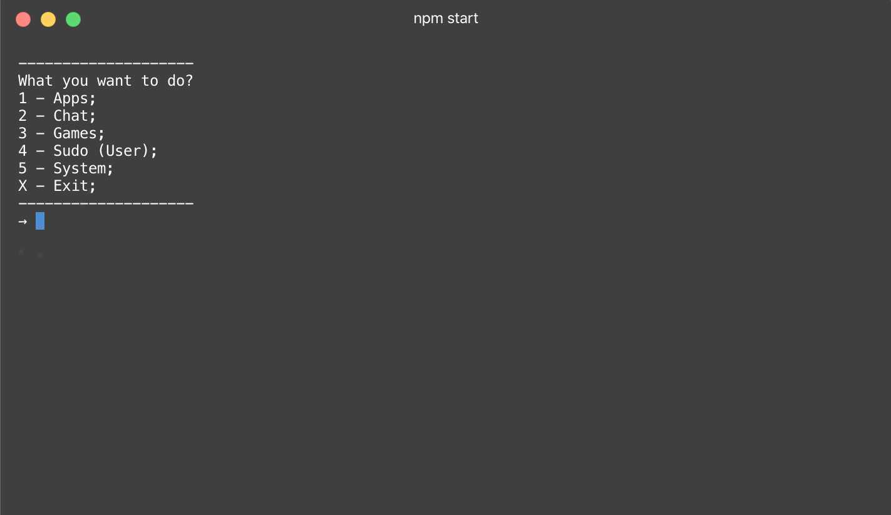
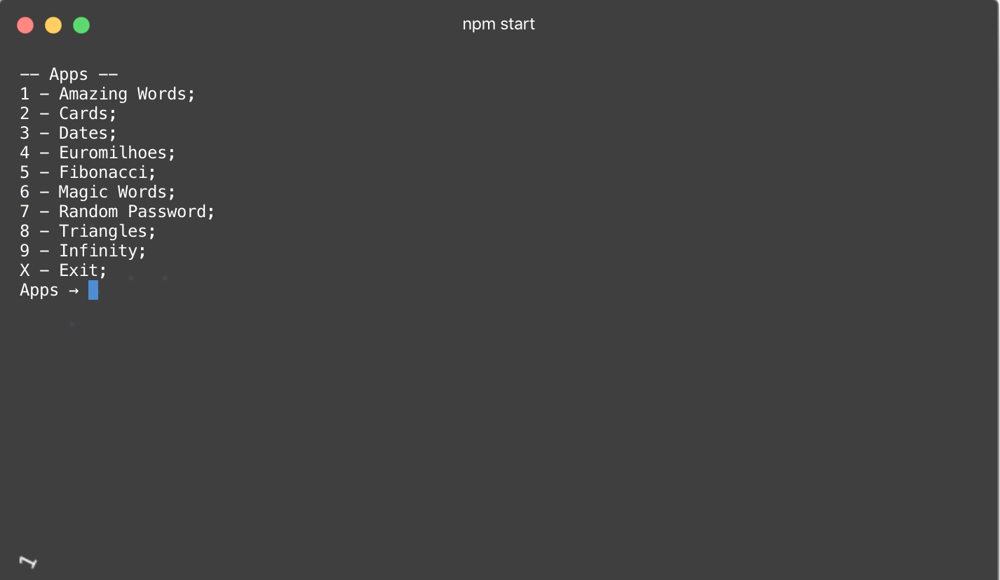
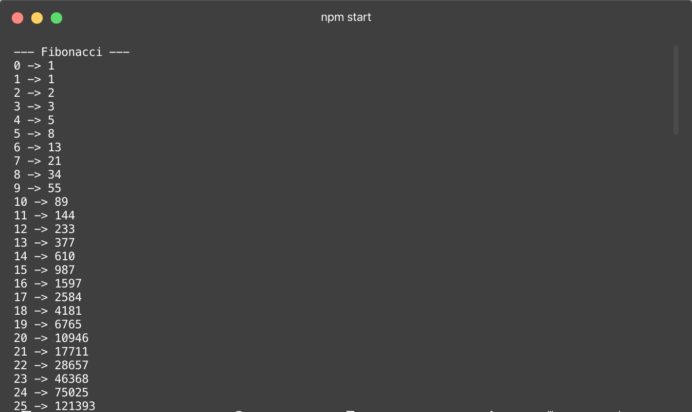
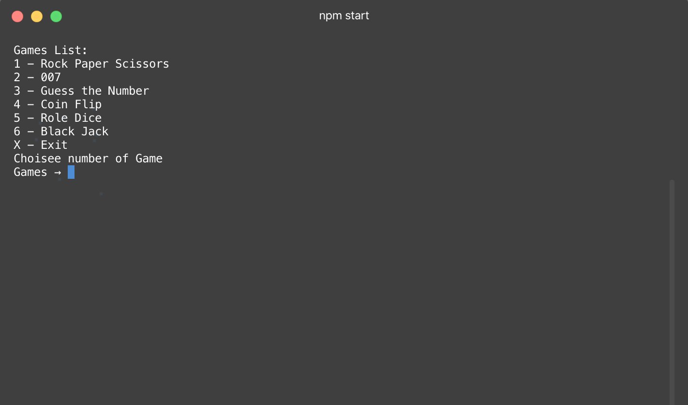
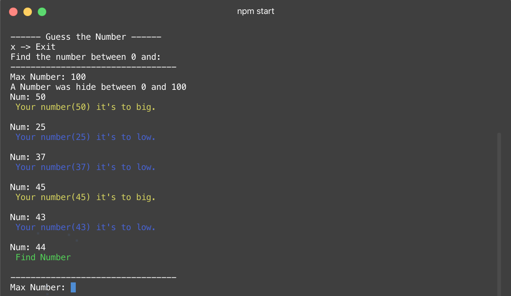

# Minerva

## Run app

- To use this app you need to install [node.js](https://nodejs.org/) and [git](https://git-scm.com/);
- After install, open your terminal;
- Clone de rep;
  - > git clone https://github.com/201flaviosilva/Minerva.git
- Enter in the folder where you have clone and run;
- > npm install
- > npm start

## Description

Just a simple console aplication with node.js;

In this app you have 5 possible options:

- Apps
- ChatBoot
- Games
- Sudo (User)
- System

| Menu        | Description                                                                                       |
| ----------- | ------------------------------------------------------------------------------------------------- |
| Apps        | Many simple codes and challenges like Fibonacci, Magic tricks with words, etc...                  |
| ChatBoot    | If you feel alone, you can always speak to an AI (Artificial Intensive) and she will answer you   |
| Games       | Have a little of fun and play this amazing (or not) games                                         |
| Sudo (User) | Here you can play with a simple DB (DataBase), like change username, birth, etc...                |
| System      | You don't know what you have in your computer, like your CPU, your battery state? Simple see here |

## Imgs

### Start App

### Menu Apps

### Fibonacci App

### Games Apps

### Gess the Number Apps

## Community

Do you think is something wrong or something can be better or have a great idea, please let me know and create a new [Issue](https://github.com/201flaviosilva/Minerva/issues)
